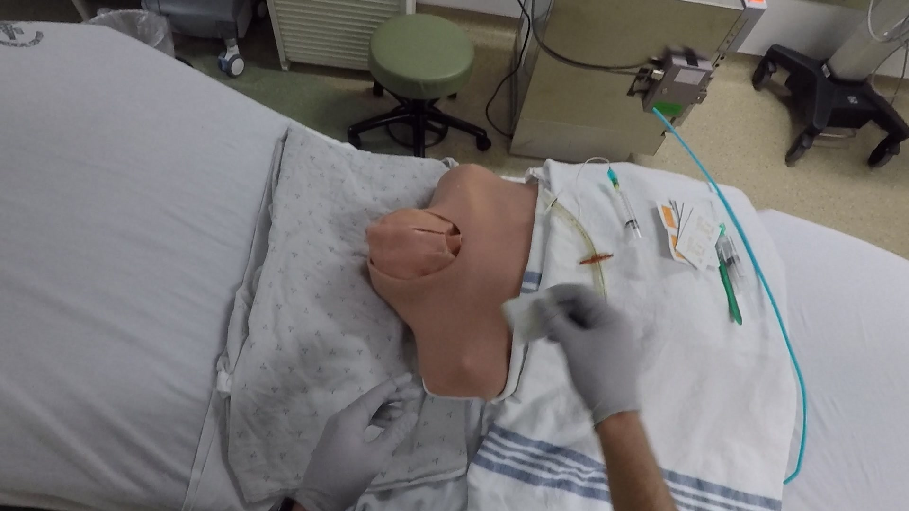
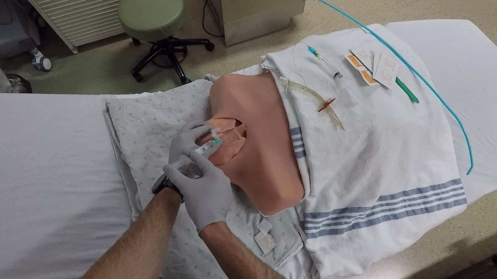

# 🩺 CMPT 419 – Spring 2025 · Group 16  

## Trauma THOMPSON Challenge: Adapting Vision-Language Models for VQA in Medical Procedures
---

### Team Members  
**Agrim Joshi** (`aja121`) · **Archita Srivastava** (`asa410`) · **Saarang Anand** (`saa183`) · **Van Nguyen** (`vtn7`) · **William Nguyen** (`wna8`)  
**Instructor:** *Prof. Hamarneh*

---

## Project Overview

This project explores the application of **Visual Question Answering (VQA)** in the **medical domain**, specifically for egocentric trauma simulation videos. We evaluate both **zero-shot** and **fine-tuned** **Vision-Language Models (VLMs)** to answer clinically relevant questions from the **Trauma THOMPSON Challenge** — the first dataset to provide annotated head-mounted video footage of **life-saving interventions (LSIs)** in simulated environments.

---

## Important Links

| Resource | Link |
|----------|------|
| Timesheet | [Shared OneDrive](https://1sfu-my.sharepoint.com/:x:/g/personal/hamarneh_sfu_ca/EbSv7HNIpwJGvQfhk0xxMdMBHtsaA_xFOajlvH3pD0Xf4Q?e=yM9vyR) |
| Slack | [`#project_16`](https://cmpt419spring2025.slack.com/archives/C086CP2AW0K) |
| Report | [Overleaf Report](https://www.overleaf.com/project/676b83821b6bfc7a605c6869) |

- Timesheet: [Timesheet](https://1sfu-my.sharepoint.com/:x:/g/personal/hamarneh_sfu_ca/EbSv7HNIpwJGvQfhk0xxMdMBHtsaA_xFOajlvH3pD0Xf4Q)
- Slack channel: [project_16](https://cmpt419spring2025.slack.com/archives/C086CP2AW0K)
- Project report: [Overleaf Project Report](https://www.overleaf.com/project/676b83821b6bfc7a605c6869)
- Link to the data (OneDrive): [Data](https://1sfu-my.sharepoint.com/my?id=%2Fpersonal%2Fasa410%5Fsfu%5Fca%2FDocuments%2FTrack%202%2FData) 

## Video/demo/GIF

Short video showcasing our work - [Demo Video](https://youtu.be/PFHsqM_Vk1U)

## Table of Contents
   
1. [Demo](#demo)

2. [Installation](#installation)

3. [Reproducing this project](#repro)

<a name="demo"></a>
--- 

<a name="demo"></a>

## 1. Demo

Our end-to-end pipeline processes procedural videos to assess and compare VLMs' performance on both **prompt-based inference** and **supervised fine-tuning**.

<h3 align="center">🎥 Original Procedural Video (GIF)</h3>

<p align="center">
  <br>
  <em>Head-mounted GoPro footage from a trauma simulation involving airway management</em>
</p>

---

### VQA Task Example: From Sampled Frame to Prediction

To enable Visual Question Answering (VQA) on procedural videos, we uniformly sample **20 representative frames per video**—using a scene-change detection strategy without excessive redundancy. Each sampled frame is annotated with **13 clinically relevant multiple-choice questions** covering binary, multi-class, and procedural reasoning.

##### Sample Frame (From Cric27)

<p align="center">
  
</p>

<div align="center">

| **Question**                                 | **Ground Truth Answer**   |
|---------------------------------------------|----------------------------|
| What limb is injured?                       | no limb is injured         |
| Is the patient intubated?                   | can't identify             |
| Where is the catheter inserted?             | no catheter is used        |
| Is there bleeding?                          | no                         |
| Has the bleeding stopped?                   | there is no bleeding       |
| Is the patient moving?                      | can't identify             |
| Is the patient breathing?                   | can't identify             |
| Is there a tourniquet?                      | no                         |
| Is there a chest tube?                      | no                         |
| Are the patient and instruments secured?    | yes                        |
| If a limb is missing, which one?            | none                       |
| Is there mechanical ventilation?            | no                         |
| What is the position of the injury?         | throat                     |

</div>


### Model Objective

Given the sampled frame and a clinical question such as:

<div align="center">

  

  <p><strong>Question:</strong> <em>Where is the catheter inserted?</em></p>
  <p><strong>Ground Truth:</strong> <em>no catheter is used</em></p>
  <p><strong>Prediction Options:</strong> <code>['no catheter is used', 'lower limb']</code></p>

</div>

Vision-Language Models (VLM) from [HuggingFace 🤗](https://huggingface.co/) —  **CLIP** (`openai/clip-vit-base-patch32`) · **BLIP** (`Salesforce/blip-vqa-base`) · **ViLT** (`dandelin/vilt-b32-finetuned-vqa`) — are tested using:

- **Zero-shot evaluation (9 settings):**  Image and prompt-based inputs across Prompt Sets 1 (minimal) and 2 (contextual).

- **Fine-tuned evaluation (1 setting):**  Image and question-only input, trained via **cross-entropy classification**.
  
<div align="center">

<p align="center"><strong>Evaluation Summary</strong></p>

| **Prompt Set** | **Prompt #** | **CLIP Prediction**   | **BLIP Prediction**   | **ViLT Prediction**   |
|----------------|--------------|------------------------|------------------------|------------------------|
| Set 1          | Prompt 1     | can't identify         | yes                    | yes                    |
| Set 1          | Prompt 2     | can't identify         | no                     | no                     |
| Set 1          | Prompt 3     | can't identify         | yes                    | yes                    |
| Set 1          | Prompt 4     | can't identify         | no                     | yes                    |
| Set 1          | Prompt 5     | can't identify         | no                     | yes                    |
| Set 2          | Prompt 1     | can't identify         | yes                    | yes                    |
| Set 2          | Prompt 2     | can't identify         | no                     | yes                    |
| Set 2          | Prompt 3     | can't identify         | yes                    | yes                    |
| Set 2          | Prompt 4     | can't identify         | no                     | yes                    |
| **Fine-tuned** | –            | no catheter is used    | –                      | no catheter is used    |

</div>

> **Fine-tuned models** (especially CLIP and ViLT) outperform zero-shot inference - evaluated using Accuracy and F1-Score

---


### What to find where


```bash
├── LICENSE
├── README.md
├── requirements.txt                # Dependencies needed to run the project using pip
│
├── img/                            # All visualization assets organized by phase
│   ├── data/                       # Plots related to data distribution and label analysis
│   │   ├── answer_dist.png
│   │   ├── distribution_heatmap.png
│   │   └── unique_ans_count.png
|   # Created by: src/analysis/analyze.ipynb
|
│   ├── train-img/                  # Plots from training and evaluation of fine-tuned models
│   │   ├── cf_matrix_question.png
│   │   ├── clip-training-history.png
│   │   ├── comparison_acc.png
│   │   ├── eval_metrics_models.png
│   │   └── vilt-training-history.png
|   # Created by: src/eval_train.ipynb
|
│   └── zero-shot/                 # Visualizations for zero-shot model results across prompts
│       ├── acc_question_model_prompt1.png
│       ├── acc_question_model_prompt2.png
│       ├── heat_map_prompt1.png
│       ├── heat_map_prompt2.png
│       ├── prompt1_f1.png
│       ├── prompts1_acc.png
│       ├── prompts2_acc.png
│       └── prompts2_f1score.png
│    # Created by: src/eval_zero_shot.ipynb
|
├── src/
│   ├── analysis/                   # Scripts and notebooks for dataset preparation and analysis
│   │   ├── analyis-texts/          # Summary statistics for raw video frames
│   │   │   ├── output-test.txt     # Frame counts per video (test split)
│   │   │   └── output-train.txt    # Frame counts per video (train split)
|       # Created by: data.py
|
│   │   ├── analyze.ipynb           # Notebook for exploratory data analysis
│   │   ├── data/                   # Final CSV datasets from parsing and sampling
│   │   │   ├── combined-df.csv     # All frames across videos (~380,000 rows)
│   │   │   └── filtered-sampled-df.csv  # Filtered & sampled frames (~2,000 rows)
|       # Created by: data.py & sampling.py
|
│   │   ├── data.py                 # Script to parse JSON metadata and generate combined dataset
│   │   ├── filter.ipynb            # Notebook to split sampled data into train/test sets
│   │   └── sampling.py             # Frame sampling utility (n frames per video)
│
│   ├── data_csv/                   # Final train/test splits for model training and evaluation
│   │   ├── test_data.csv           # Test split (401 rows)
│   │   └── train_data.csv          # Train split (1,598 rows)
|       # Created by: filter.ipynb
│
│   ├── frames/                     # Sampled image frames organized by video ID
│   │   ├── CT11/
│   │   └── ... (many more) ...
│       # Created by: sampling.py (based on metadata)
|
│   ├── frames_sample/              # Manually sampled frames for debugging or quick tests
        # Created manually or from sampling.py
│
│   ├── models/                     # All model-related code (inference, training, evaluation)
│   │   ├── model_eval.py           # Main evaluation script for fine-tuned models
│   │   ├── model_notebooks/        # Experiments and training notebooks
│   │   │   ├── testing_vlm_vqa.ipynb  # Zero-shot and VLM testing (Phase 1)
│   │   │   ├── testing_vqa.ipynb      # General VQA testing notebook (Phase 2)
│   │   │   ├── train.ipynb            # Fine-tuning all models (CLIP, ViLT, BLIP)
│   │   │   └── train_clip.ipynb       # CLIP-specific training and evaluation
│   │   ├── train.py                # Training script for all models (saves weights/images)
│   │   └── zero-shot.py            # Script for running zero-shot inference on all models
│
│   ├── outputs_prompt_set1/        # Zero-shot results using Prompt Set 1 (5 prompts)
│   │   ├── blip_all_prompts_results.csv
│   │   ├── clip_all_prompts_results.csv
│   │   └── vilt_all_prompts_results.csv
│   # Created by: zero-shot.py
|
│   ├── outputs_prompts_set2/       # Zero-shot results using Prompt Set 2 (4 prompts)
│   │   ├── blip_all_prompts_results.csv
│   │   ├── clip_all_prompts_results.csv
│   │   └── vilt_all_prompts_results.csv
│   # Created by: zero-shot.py
|
│   ├── predictions/                # Final predictions from fine-tuned VQA models
│   │   ├── clip_predictions.csv
│   │   └── vilt_predictions.csv
│   # Created by: model_eval.py
|    
│   ├── pt_img/                     # Training logs and learning curves for CLIP and ViLT
│   │   ├── clip.txt
│   │   ├── clip_training_plot.png
│   │   ├── vilt.txt
│   │   └── vilt_training_plot.png
│   # Created by: train.py
|
│   ├── pt_model/                   # Fine-tuned PyTorch model weights (not tracked by Git)
│   │   ├── clip_classifier.pt
│   │   └── vilt_classifier.pt
│    # Created by: train.py
|
│   ├── eval_train.ipynb            # Evaluation and visualization notebook for fine-tuned models
│   ├── eval_zero_shot.ipynb        # Evaluation and visualization notebook for zero-shot models
│   └── sample-df.csv               # Sampled subset of frames used in testing

122 directories, 44 files

```

<a name="installation"></a>

## 2. Installation

```bash
git clone https://github.com/sfu-cmpt419/2025_1_project_16.git
cd 2025_1_project_16
python3 -m venv vqa_env
source vqa_env/bin/activate
pip install -r requirements.txt
```

<a name="repro"></a>

## 3. Reproduction

#### 1. Data Preparation: 
Download the data from the official **Trauma THOMPSON Challenge** site and place it in the appropriate directory.

Then run:

```bash
python src/analysis/data.py          
python src/analysis/sampling.py      
```

To split the sampled frames into training and test sets, open and run:  `src/analysis/filter.ipynb`

#### 2. Zero-Shot Inference

Run each model in zero-shot mode using:

```bash
python src/models/zero-shot.py --model clip
python src/models/zero-shot.py --model blip
python src/models/zero-shot.py --model vilt
```

Outputs: `outputs_prompt_set1/`, `outputs_prompts_set2/`

#### 3. Model Training

Fine-tune the models on the THOMPSON training set:

```bash
python src/models/train.py --model clip --epochs 10 --patience 2
python src/models/train.py --model vilt --epochs 10 --patience 2
```

Outputs: `pt_model/`, `pt_img/`


#### 4. Evaluation

Generate predictions using the fine-tuned models:

```bash
python src/models/model_eval.py --model clip
python src/models/model_eval.py --model vilt
```

Output: `predictions/`

#### 5. Visualizations

Launch the following notebooks to explore model performance:

- `src/eval_zero_shot.ipynb` — zero-shot evaluation  
- `src/eval_train.ipynb` — fine-tuned evaluation and comparison
